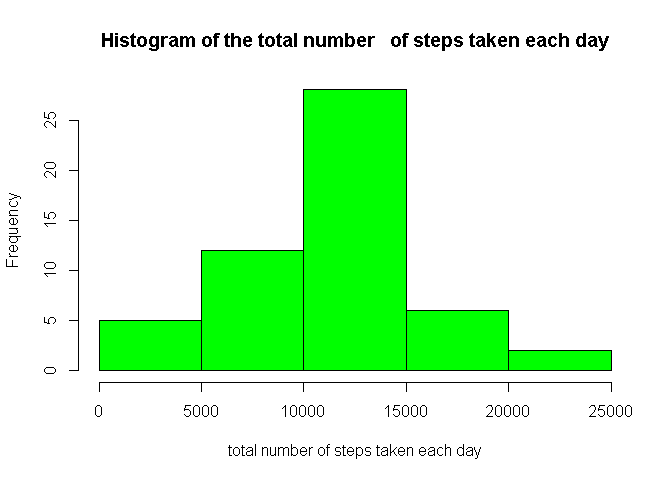
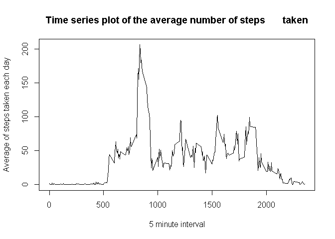
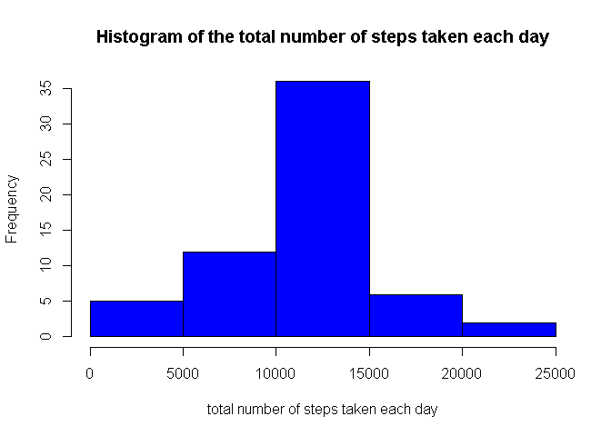
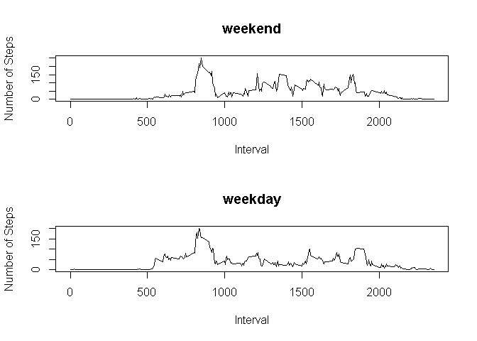

Project1
=========================================

 ## *"This assignment will be described in multiple parts. You will need to write a report that answers the questions detailed         below".*


## Loading and preprocessing the data

 1. Loading and preprocessing the data
  
    1. Load the data (read.csv())
    2. Process/transform the data (if necessary) into a format suitable for your analysis


**1) Code for reading in the dataset and/or processing the data**

 once the file are in your directory through read.csv function, we read the file "activity.csv"
 

```r
  setwd("D:\\econimoia 2\\Big data\\Curso10") 
  ## once the file are in your directory
  Question1 <- read.csv("activity.csv") # 1.1 Load the data (read.csv())
```

## What is mean total number of steps taken per day?

2. What is mean total number of steps taken per day?
  
    1. Calculate the total number of steps taken per day
    2. If you do not understand the difference between a histogram and a barplot, research the difference between them. Make a histogram of the total number of steps taken each day
    3.Calculate and report the mean and median of the total number of steps taken per day
    
    
    **2) Histogram of the total number of steps taken each day**

 through tapply function, we get the total of steps (sum) for each day (date), with the result we create a data frame, where the total column is the total number of steps taken each day, this information is for  the histogram


```r
  setwd("D:\\econimoia 2\\Big data\\Curso10")
  Data <- read.csv("activity.csv") #assign this just for "convenience"
  Question1 <- with(Data,tapply(steps,date,sum)) # 2.1 Calculate the total number of steps taken per day
  Question11 <- data.frame(Days=names(Question1), total=Question1)

  Question2 <- hist(Question11$total, col="green", xlab="total number of steps taken each day", main="Histogram of the total number   of steps taken each day") # 2.2 Make a histogram of the total number of steps taken each day
```

<!-- -->

**3) Mean and median number of steps taken each day**

   with the data of the histogram above, we get the mean and median removing the NAs
 


```r
  good <- complete.cases(Question11$total)
  Question111 <- Question11[good, ]
  Question3 <- mean(Question111$total) # 2.3 Calculate and report the mean and median of the total number of steps taken per day
  Question33 <- median(Question111$total) # 2.3 Calculate and report the mean and median of the total number of steps taken per day

  Question3
```

```
## [1] 10766.19
```

```r
  Question33
```

```
## [1] 10765
```

## What is the average daily activity pattern?

3. What is the average daily activity pattern?
  
    1. Make a time series plot type="l" of the 5-minute interval (x-axis) and the average number of steps taken, averaged across all days (y-axis)
    2. Which 5-minute interval, on average across all the days in the dataset, contains the maximum number of steps?


**4) Time series plot of the average number of steps taken**
 with complete.cases function, we subset the original data, to remove NAs,
 through tapply function, we get the Average of steps (mean) for each day (interval), with the result we create a data frame, where the interval column is the 5-minute interval (x-axis), and Average column is averaged across all days (y-axis)
 


```r
  good2 <- complete.cases(Data)
  Data2 <- Data[good2, ]
  
  Question4 <- with(Data2,tapply(steps,interval,mean))
  Question44 <- data.frame(Interval=names(Question4), Average=Question4)
  Question44$Interval <- as.character(Question44$Interval)
  Question44$Interval <- as.numeric(Question44$Interval)

  Question4 <- plot(Question44$Interval, Question44$Average, type="l", main="Time series plot of the average number of steps       taken", xlab="5 minute interval", ylab="Average of steps taken each day" ) # 3.1 Make a time series plot type="l" of the 5-minute interval (x-axis) and the average number of steps taken, averaged across all days (y-axis)
```

<!-- -->

**5) The 5-minute interval that, on average, contains the maximum number of steps**

 with plyr package we bring the arrange function, with this function, we sort in descending order the Average column of the data frame that has the  Average number of steps taken, so the first row, is The 5-minute interval that, on average, contains the maximum number of steps
 
 

```r
  library(plyr)
```

```
## Warning: package 'plyr' was built under R version 3.6.3
```

```r
  Question5 <- arrange(Question44, desc(Average))
  Question5[1, ] # 3.2 Which 5-minute interval, on average across all the days in the dataset, contains the maximum number of steps?
```

```
##   Interval  Average
## 1      835 206.1698
```

## Imputing missing values

 4. Imputing missing values
  
   1. Calculate and report the total number of missing values in the dataset (i.e. the total number of rows with Nas)
   2. Devise a strategy for filling in all of the missing values in the dataset. The strategy does not need to be sophisticated. For example, you could use the mean/median for that day, or the mean for that 5-minute interval, etc
   3.Create a new dataset that is equal to the original dataset but with the missing data filled in.
   4. Make a histogram of the total number of steps taken each day and Calculate and report the mean and median total number of steps taken per day. Do these values differ from the estimates from the first part of the assignment? What is the impact of imputing missing data on the estimates of the total daily number of steps?
   
   **6) Code to describe and show a strategy for imputing missing **

 I think that for this point, is better explain every step:
 
**4.1) Calculate and report the total number of missing values in the dataset (i.e. the total number of rows with Nas)**
   
   through is,na() function, we get the Logical vector(Trues == 1) of NAs in the Data, so with sum functon we get the total of Nas in the Data
    

```r
  Question61 <- sum(is.na(Data))
  Question62 <- mean(is.na(Data))*100 # percent of Nas in all the data set
 
  Question61 #4.1 Calculate and report the total number of missing values in the dataset (i.e. the total number of rows with Nas)
```

```
## [1] 2304
```

```r
  Question62
```

```
## [1] 4.371585
```
**6.2) Devise a strategy for filling in all of the missing values in the dataset. The strategy does not need to be sophisticated.**
   
   So, the strategy is merge the Original Data, and the Data that has the  Average number of steps taken (Question44), so we are going to replace the Average number of steps taken in the NAs values of the original data;
   

```r
  DataWithAverageByInterval <- merge(Data,Question44,by.x="interval",by.y="Interval") #4.2 Code to describe and show a strategy for imputing missing 
```

First we see the original data before the merge and after


```r
  tail(arrange(Data, date))
```

```
##       steps       date interval
## 17563    NA 2012-11-30     2330
## 17564    NA 2012-11-30     2335
## 17565    NA 2012-11-30     2340
## 17566    NA 2012-11-30     2345
## 17567    NA 2012-11-30     2350
## 17568    NA 2012-11-30     2355
```

```r
  tail(arrange(DataWithAverageByInterval, date))
```

```
##       interval steps       date   Average
## 17563     2330    NA 2012-11-30 2.6037736
## 17564     2335    NA 2012-11-30 4.6981132
## 17565     2340    NA 2012-11-30 3.3018868
## 17566     2345    NA 2012-11-30 0.6415094
## 17567     2350    NA 2012-11-30 0.2264151
## 17568     2355    NA 2012-11-30 1.0754717
```
 Now, through a for loop we "put" the Average column , in the steps column if There is a NA value; and we see the result


```r
  for(i in 1:17568){
   if(is.na(DataWithAverageByInterval$steps[i])) {
            DataWithAverageByInterval$steps[i] <- DataWithAverageByInterval$Average[i]
            
         } 
  }    #4.2 Code to describe and show a strategy for imputing missing 

  tail(arrange(DataWithAverageByInterval, date))
```

```
##       interval     steps       date   Average
## 17563     2330 2.6037736 2012-11-30 2.6037736
## 17564     2335 4.6981132 2012-11-30 4.6981132
## 17565     2340 3.3018868 2012-11-30 3.3018868
## 17566     2345 0.6415094 2012-11-30 0.6415094
## 17567     2350 0.2264151 2012-11-30 0.2264151
## 17568     2355 1.0754717 2012-11-30 1.0754717
```
**6.3) Create a new dataset that is equal to the original dataset but with the missing data filled in..**
 Pratically this already has been done, but we are going to made it exactly as the original, 
 for that, we reomve the Average column, 


```r
  Question63 <- DataWithAverageByInterval[ ,c(1,2,3)]
  head(arrange(Question63,date))
```

```
##   interval     steps       date
## 1        0 1.7169811 2012-10-01
## 2        5 0.3396226 2012-10-01
## 3       10 0.1320755 2012-10-01
## 4       15 0.1509434 2012-10-01
## 5       20 0.0754717 2012-10-01
## 6       25 2.0943396 2012-10-01
```
 and move the interval column to the right side


```r
  Question63 <- DataWithAverageByInterval[ ,c(2,3)]
  Question63 <- cbind(Question63,DataWithAverageByInterval$interval) #4.3 Create a new dataset that is equal to the original dataset but with the missing data filled in
  names(Question63)[names(Question63) == "DataWithAverageByInterval$interval"] <- "interval"
  head(arrange(Question63,date))
```

```
##       steps       date interval
## 1 1.7169811 2012-10-01        0
## 2 0.3396226 2012-10-01        5
## 3 0.1320755 2012-10-01       10
## 4 0.1509434 2012-10-01       15
## 5 0.0754717 2012-10-01       20
## 6 2.0943396 2012-10-01       25
```
Finally we compare with the original


```r
  head(arrange(Data,date))
```

```
##   steps       date interval
## 1    NA 2012-10-01        0
## 2    NA 2012-10-01        5
## 3    NA 2012-10-01       10
## 4    NA 2012-10-01       15
## 5    NA 2012-10-01       20
## 6    NA 2012-10-01       25
```

**7)Histogram of the total number of steps taken each day after missing values are imputed**

   Finally we compare with the original


```r
  DataWithNASreplaced <- Question63

  Question64 <- with(DataWithNASreplaced,tapply(steps,date,sum))
  Question664 <- data.frame(Days=names(Question64), total=Question64)


  Question7 <- hist(Question664$total, col="blue", xlab="total number of steps taken each day", main="Histogram of the total number of steps taken each day")  # 4.4 Make a histogram of the total number of steps taken each day and Calculate and report the mean and median total number of steps taken per day. 
```

<!-- -->

*4.4) Do these values differ from the estimates from the first part of the assignment? What is the impact of imputing missing data on the estimates of the total daily number of steps? *

For this case, the impact is too low, the mean and median practically don't change

```r
   Question6mean <- mean(Question664$total)
   Question6meadian <- median(Question664$total)

  Question6mean  # 4.4 Do these values differ from the estimates from the first part of the assignment? What is the impact of imputing missing data on the estimates of the total daily number of steps? *
```

```
## [1] 10766.19
```

```r
  Question6meadian 
```

```
## [1] 10766.19
```

## Are there differences in activity patterns between weekdays and weekends?

5. Are there differences in activity patterns between weekdays and weekends?
  
    1. Create a new factor variable in the dataset with two levels – “weekday” and “weekend” indicating whether a given date is a weekday or weekend day.
    2. Make a panel plot containing a time series plot (i.e. \color{red}{\verb|type = "l"|}type = "l") of the 5-minute interval (x-axis) and the average number of steps taken, averaged across all weekday days or weekend days (y-axis). See the README file in the GitHub repository to see an example of what this plot should look like using simulated data.
    
    
    *5.1) Create a new factor variable in the dataset with two levels – “weekday” and “weekend” indicating whether a given date is a weekday or weekend day. *

 For this, first of all, we need change the class of Date column(as date) of the new dataset with the missing data filled in


```r
   library(lubridate)
```

```
## Warning: package 'lubridate' was built under R version 3.6.3
```

```
## 
## Attaching package: 'lubridate'
```

```
## The following objects are masked from 'package:base':
## 
##     date, intersect, setdiff, union
```

```r
Question63$date <- as.character(Question63$date)
Question63$date <- as.Date(Question63$date, format="%Y-%m-%d")
```

The, we create the new variable and add it to the Dataset through cbind function and call it "wday" for this step, was necessary brought the wday function from lubridate package


```r
   Question63 <- cbind(Question63,wday(Question63$date))
names(Question63)[names(Question63) == "wday(Question63$date)"] <- "wday"
```
 
Now with that Variable, we create 2 levels, assigning numbers 1 through 5 as "weekday", and 6 and 7 as "weekend"; all of this is made through a for loop, and finally we assign the class factor to the variable through as.factor() function


```r
   for(i in 1:17568){
     if(Question63$wday[i] %in% 1:5){
             Question63$wday[i] <-"weekday"
       }
     else { Question63$wday[i] <-"weekend" }
   }

Question63$wday <- as.factor(Question63$wday)

Question81 <- Question63

head(Question81)
```

```
##      steps       date interval    wday
## 1 1.716981 2012-10-01        0 weekday
## 2 0.000000 2012-11-23        0 weekend
## 3 0.000000 2012-10-28        0 weekday
## 4 0.000000 2012-11-06        0 weekday
## 5 0.000000 2012-11-24        0 weekend
## 6 0.000000 2012-11-15        0 weekday
```

And we see the data with the new varaible of factor class


```r
Question81 <- Question63

head(Question81)
```

```
##      steps       date interval    wday
## 1 1.716981 2012-10-01        0 weekday
## 2 0.000000 2012-11-23        0 weekend
## 3 0.000000 2012-10-28        0 weekday
## 4 0.000000 2012-11-06        0 weekday
## 5 0.000000 2012-11-24        0 weekend
## 6 0.000000 2012-11-15        0 weekday
```

**8) Panel plot comparing the average number of steps taken per 5-minute interval across weekdays and weekends**

  *5.2) Create a new factor variable in the dataset with two levels – “weekday” and “weekend” indicating whether a given date is a weekday or weekend day. *
  
   For this last point, we use the functiion split() to create a list with 2 components, the weekdays and the weekends, wtih that list, we use lapply() function to apply to the list created with split, and the tapply() function to create a list whith the 2 componets where the components of the components are 2 vectors that has the mean by interval for every level weekday and weekend
   
Finally with this data, we get 2 plots for weekday and weekend


```r
  ByWeek <- split(Question81, Question81$wday)


  ByInterval <- function(x) {
   with(x,tapply(steps,interval,mean))

   }

  PlotsData <- lapply(ByWeek,ByInterval)

  Wday <- data.frame(Interval =names(PlotsData[[1]]), NumberOfSteps=PlotsData[[1]])
  Wend <- data.frame(Interval =names(PlotsData[[2]]), NumberOfSteps=PlotsData[[2]])

  Wday$Interval <- as.character(Wday$Interval)
  Wday$Interval <- as.character(Wday$Interval)
  Wend$Interval <- as.character(Wend$Interval)
  Wend$Interval <- as.character(Wend$Interval)

  par(mfcol=c(2,1))

  plot(Wend$Interval, Wend$NumberOfSteps, type="l", xlab="Interval", ylab="Number of Steps", main="weekend")
  plot(Wday$Interval, Wday$NumberOfSteps, type="l", xlab="Interval", ylab="Number of Steps", main="weekday")
```

<!-- -->
    
